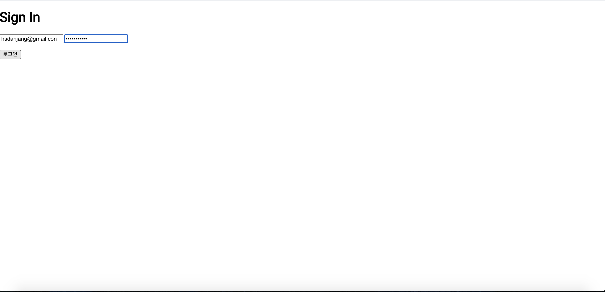
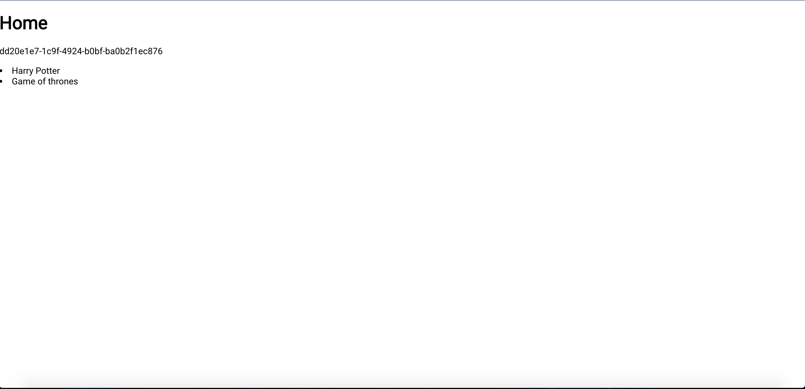

## Book Collection

패스트캠퍼스 React 수업을 수강하면서 만들었던 웹 애플리케이션(SPA) 입니다. 백엔드 REST API와 연동하면서 login authentication, token, 그리고 session storage를 활용할 수 있었던 프로젝트입니다.

아직 완성한 프로젝트는 아니며 UI/UX 개선과 리덕스 미들웨어 적용을 진행하고 있습니다.

## Installation Instructions

이 Repository를 클론하시고 `yarn start` 로 서버를 시작한 다음 `localhost:3000/Book-Collection` 으로 이동하면 됩니다.

SignIn 페이지에서 로그인하면 홈 화면에서 유저의 token과 db에 저장된 책 자료를 볼 수 있습니다.

## Screen Shots

